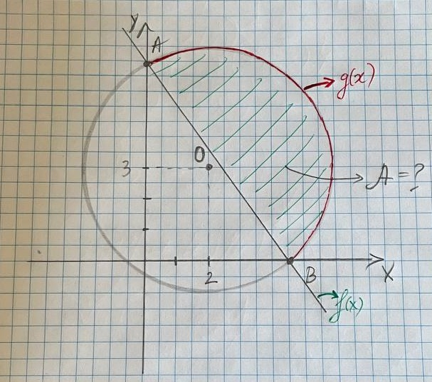

# Proiect pentru reprezentarea grafică a ariei unui segment

Acest proiect utilizează bibliotecile `matplotlib` și `numpy` pentru a reprezenta grafic aria unui segment.

## Descriere
Proiectul ilustrează modul în care putem calcula și vizualiza aria unui segment de cerc folosind Python. Utilizând `numpy` pentru calcule și `matplotlib` pentru generarea graficelor. Totodată, calculele sunt făcute anterior, deci în program integrarea este făcută prin `fill_between`

## Problema 


## Platforma și instrumentele
- Python
- Matplotlib
- Numpy

## Cum să rulezi proiectul
1. Clonează acest repository:
   ```bash
   git clone https://github.com/krovskiy/Aria-segmentului-reprezentare-grafica.git
2. Instalează dependințele:
   ```bash
   pip install -r requirements.txt
4. Rulează programul:
   ```bash
   python main.py
## Mulțumiri
- **Profesor**: IONESCU Viorel - pentru elaborarea problemei!
- **Coleg**: CORLĂTEANU Igor - pentru ajutor! :)

